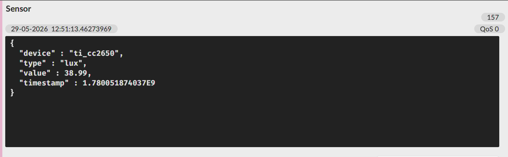
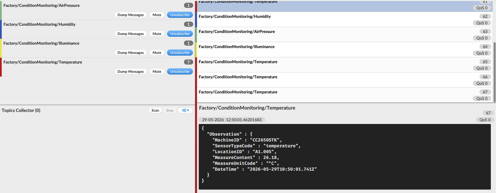
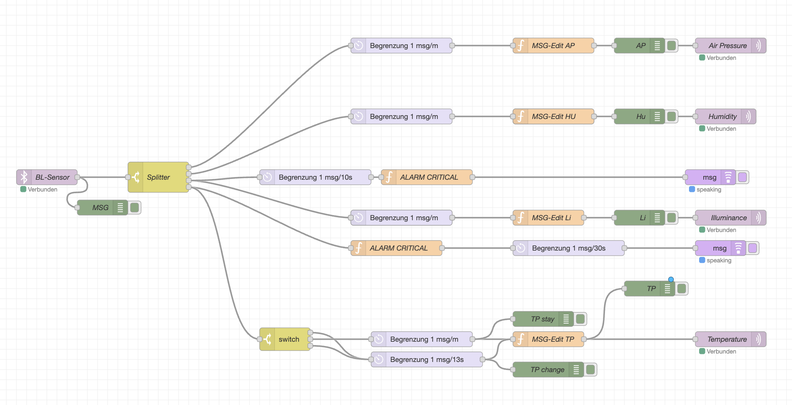

# Projektkontext & Systemarchitektur

## Agenda

- **Teil 1** – Projektkontext & Systemarchitektur *(Person 1)*
- **Teil 2** – Theoretische Grundlagen: Bluetooth, MQTT, Edge Computing *(Person 2)*
- **Teil 3** – Implementierung: Python, MQTT-Konfiguration, Node-RED *(Person 3)*
- **Teil 4** – Live-Demo & Fazit *(Person 4)*

::: notes
Guten Tag, mein Name ist [Name] und ich präsentiere heute gemeinsam mit meinen Kolleginnen und Kollegen unsere Projektergebnisse aus dem Modul MW220. Wir sind Gruppe 2 und haben uns mit der drahtlosen Sensoranbindung, der MQTT-Kommunikation und der Datenverarbeitung mit Node-RED beschäftigt. Unsere Präsentation gliedert sich in vier Teile – zunächst stelle ich den Projektkontext vor, dann folgen die technischen Grundlagen, die Implementierung und abschließend die Live-Demo.
:::

## Das Gesamtprojekt

**„LEGO Mindstorms Color Sorter meets Industrie 4.0"**

Ein LEGO Mindstorms EV3-System sortiert Bausteine nach Farbe – eingebettet in eine vollständige IoT-Infrastruktur.

| Gruppe | Aufgabe |
|---|---|
| Gruppe 1 | LEGO EV3 Steuerung & Sensorauslese |
| **Gruppe 2** | **BT-Anbindung, MQTT, Edge Computing (Node-RED)** |
| Gruppe 3 | Datenbankanbindung (MariaDB) |
| Gruppe 4 | ThingsBoard-Dashboard & Visualisierung |

→ Vier Gruppen bilden gemeinsam eine durchgängige Industrie-4.0-Pipeline

::: notes
Das übergreifende Lehrprojekt heißt „LEGO Mindstorms Color Sorter meets Industrie 4.0". Grundlage ist ein LEGO EV3-System, das Bausteine nach Farben sortiert – ein vereinfachtes Modell einer industriellen Produktionsanlage. Vier Gruppen decken zusammen die gesamte IoT-Wertschöpfungskette ab. Unsere Gruppe 2 ist das Bindeglied zwischen der physischen Welt – dem Sensor – und der digitalen Verarbeitungsinfrastruktur.
:::

## Aufgabe Gruppe 2: Drei Teilziele

**Teilziel 1 – Bluetooth-Anbindung**

- TI SensorTag CC2650 → Raspberry Pi
- Drahtlose Übertragung von Temperatur, Licht, Luftdruck, Luftfeuchtigkeit

**Teilziel 2 – MQTT-Weiterleitung**

- Raspberry Pi → MQTT-Broker (IWILR4-11)
- Strukturierte Topics, JSON-Payload, QoS 2

**Teilziel 3 – Edge Computing & Filterung**

- Node-RED auf IWILR4-10
- Rate-Limiting, Observation-Format, Alarm-Logik

::: notes
Unsere drei Teilziele bauen aufeinander auf. Zuerst müssen die Sensordaten drahtlos vom TI SensorTag CC2650 zum Raspberry Pi gelangen – das ist Bluetooth. Dann werden die Daten über MQTT an den zentralen Broker weitergeleitet. Und schließlich verarbeitet Node-RED diese Daten am Edge: filtert, strukturiert und stellt sie den nachgelagerten Gruppen in einem einheitlichen Format bereit. Ohne unser Bindeglied hätte keine der anderen Gruppen Sensordaten zur Verfügung.
:::

## Systemarchitektur Gruppe 2

```
TI CC2650 SensorTag
       |
       |  Bluetooth Low Energy (BLE, IEEE 802.15.1)
       v
 Raspberry Pi  ---- sensor.py (Python / bleak)
       |
       |  MQTT, Port 1883, Topic: "Sensor"
       v
 MQTT-Broker IWILR4-11
       |
       |  MQTT, QoS 2
       v
 Node-RED  IWILR4-10:1880
       |
       +-- Factory/ConditionMonitoring/Temperature
       +-- Factory/ConditionMonitoring/Humidity
       +-- Factory/ConditionMonitoring/AirPressure
       +-- Factory/ConditionMonitoring/Illuminance
                  |
                  v
     ThingsBoard (Gr. 4)  /  DB (Gr. 3)
```

Einordnung: **Perception Layer** → **Network Layer** → **Data Processing Layer**

::: notes
Diese Folie zeigt die vollständige Architektur unseres Teilsystems. Der TI SensorTag sendet per Bluetooth Low Energy Messdaten an den Raspberry Pi. Ein Python-Skript empfängt diese Daten und publiziert sie als JSON auf dem MQTT-Topic „Sensor". Der zentrale Broker auf IWILR4-11 verteilt die Nachrichten, Node-RED abonniert sie und verarbeitet sie zu strukturierten Observations, die dann über vier Topics an die nachgelagerten Gruppen bereitstehen. Das entspricht dem klassischen IoT-Drei-Schichten-Modell. Ich übergebe jetzt an [Person 2] für die theoretischen Grundlagen.
:::

---

# Theoretische Grundlagen

## Bluetooth Low Energy (BLE)

**Standard:** IEEE 802.15.1 | 2,402–2,480 GHz | Frequenzsprungverfahren

**GATT-Architektur:**

- **Central** (Raspberry Pi) liest vom **Peripheral** (SensorTag)
- **Service** → **Charakteristikum** → **Notification** bei neuer Messung
- Aktivierung: `0x01` in Config-Charakteristikum schreiben

**Warum BLE?**

- TI CC2650 hat BLE nativ eingebaut
- Batteriebetrieb über Monate möglich
- Reichweite ~10 m deckt Laborumgebung ab

| Technologie | Reichweite | Energie | Datenrate |
|---|---|---|---|
| **BLE** | 1–100 m | sehr niedrig | ~1 Mbit/s |
| WLAN | 30–100 m | hoch | >100 Mbit/s |
| ZigBee | 10–100 m | niedrig | 250 kbit/s |

::: notes
Guten Tag, ich bin [Name] und erläutere die technologischen Grundlagen. Beginnen wir mit Bluetooth Low Energy. BLE ist seit 2010 standardisiert und auf minimalen Stromverbrauch optimiert. Das für uns wichtige Konzept ist das GATT-Protokoll: Der Raspberry Pi als Central fragt Daten vom SensorTag als Peripheral ab. Durch Notifications bekommen wir automatisch einen neuen Wert, sobald sich etwas ändert. BLE war für uns die richtige Wahl, weil der SensorTag es nativ unterstützt und wir keine zusätzliche Hardware brauchen.
:::

## MQTT: Das wichtigste IoT-Protokoll

**Publish/Subscribe über Message Broker:**

```
Python-Skript (Publisher)
    |  Topic: "Sensor"
    v
  MQTT Broker (IWILR4-11)
    |
    +---> Node-RED (Subscriber)
    +---> Weitere Clients
```

**Kernkonzepte:**

- **Topics:** hierarchisch, z. B. `Factory/ConditionMonitoring/Temperature`
- **QoS 2** → genau einmal zugestellt (kein Verlust, kein Duplikat)
- **Retained Message:** neuer Subscriber erhält sofort letzten bekannten Wert
- **Last Will & Testament:** Broker meldet automatisch Verbindungsabbruch

**Warum MQTT statt HTTP?**
→ ~2 Byte Header vs. ~800 Byte HTTP | Lose Kopplung | OASIS-Standard seit 2013

::: notes
MQTT ist das meistverwendete Protokoll im IoT-Umfeld. Das Publish/Subscribe-Modell entkoppelt Datenproduzenten von Datenkonsumenten vollständig. Unser Python-Skript publiziert Sensordaten an den Broker, ohne zu wissen, wer sie konsumiert. Wenn eine neue Gruppe Daten benötigt, abonniert sie einfach das passende Topic – ohne dass wir etwas ändern müssen. Wir nutzen QoS 2 für den Eingang, weil jede Messung exakt einmal verarbeitet werden soll. Im Vergleich zu HTTP ist der Overhead verschwindend gering – entscheidend für ressourcenbeschränkte Geräte.
:::

## Edge Computing & Node-RED

**Edge/Fog Computing:**

| | Edge (Raspberry Pi) | Cloud |
|---|---|---|
| Latenz | Millisekunden | Sekunden |
| Datenvolumen | reduziert (gefiltert) | vollständig |
| Ausfallsicherheit | funktioniert offline | verbindungsabhängig |

**Node-RED – Flow-basierte Programmierung:**

- Open-Source (IBM / OpenJS Foundation), basiert auf Node.js
- Visuell: Nodes per Drag & Drop verbinden
- Realisiert **Stream-Processing-Konzepte:**
  - Continuous Queries: dauerhaft laufende Filter
  - Rate Limiting: Drosselung auf 1 Nachricht/Minute
  - Threshold Monitoring: Schwellenwertüberwachung in Echtzeit

::: notes
Edge Computing bedeutet: Wir verarbeiten die Daten nicht in der Cloud, sondern direkt auf dem Raspberry Pi im Hochschulnetz. Das hat drei wesentliche Vorteile: kürzere Latenzen, weniger Datenvolumen und das System funktioniert auch bei Verbindungsabbruch. Node-RED ist das Werkzeug, mit dem wir diese Edge-Verarbeitung visuell implementieren. Es realisiert klassische Stream-Processing-Konzepte: fortlaufende Filterung, zeitliche Drosselung und Schwellenwertüberwachung. Das sehen wir gleich in der Live-Demo. Ich übergebe an [Person 3].
:::

---

# Implementierung

## Python: Bluetooth-Anbindung

**Zweistufiger Ansatz:**

**Schritt 1 – `find_and_connect.py` (Discovery)**

```python
ADDRESS = "98:07:2D:27:F1:86"  # TI CC2650 SensorTag MAC
device = await BleakScanner.find_device_by_address(ADDRESS, timeout=15.0)
# Listet alle GATT-Services und Charakteristika auf
```

**Schritt 2 – `sensor.py` (Produktivbetrieb)**

```python
for name, uuids in SENSORS.items():
    await client.write_gatt_char(uuids["config"], b"\x01")  # Sensor aktivieren
    await client.start_notify(uuids["data"], notification_handler)
```

**Rohdaten-JSON (Topic: `Sensor`):**

```json
{ "device": "ti_cc2650", "type": "temperature",
  "value": 26.18, "timestamp": 1780051874.037 }
```



::: notes
Guten Tag, ich bin [Name] und zeige unsere Implementierung. Wir haben die Bluetooth-Anbindung in zwei Schritten entwickelt. Zuerst ein Discovery-Skript, das sich mit dem SensorTag verbindet und alle GATT-Services auflistet – damit konnten wir die richtigen UUIDs identifizieren. Das Produktivskript aktiviert dann jeden Sensor durch Schreiben von 0x01 in das Config-Charakteristikum und abonniert die Notifications. Bei jeder neuen Messung wandelt der Handler die Rohdaten in JSON um und publiziert es auf dem MQTT-Topic „Sensor".
:::

## MQTT-Konfiguration & Topics

**Broker:** `IWILR4-11.CAMPUS.fh-ludwigshafen.de`, Port 1883

**Zwei-Stufen-Pipeline:**

| Stufe | Topic | Format |
|---|---|---|
| Eingang | `Sensor` | Rohdaten (device, type, value, timestamp) |
| Ausgang | `Factory/ConditionMonitoring/Temperature` | Observation |
| Ausgang | `Factory/ConditionMonitoring/Humidity` | Observation |
| Ausgang | `Factory/ConditionMonitoring/AirPressure` | Observation |
| Ausgang | `Factory/ConditionMonitoring/Illuminance` | Observation |

**Observation-Format:**

```json
{ "Observation": { "MachineID": "CC2650STK",
  "SensorTypeCode": "temperature", "LocationID": "A1.005",
  "MeasureContent": 26.18, "MeasureUnitCode": "°C",
  "DateTime": "2026-05-29T10:50:01.741Z" } }
```



::: notes
Die MQTT-Infrastruktur ist in zwei Stufen aufgebaut. Das Python-Skript publiziert kompakte Rohdaten auf dem Topic „Sensor". Node-RED abonniert dieses Topic, transformiert die Rohdaten und publiziert strukturierte Observation-Nachrichten auf vier spezifischen Ausgangs-Topics. Das Observation-Format enthält alle Metadaten, die nachgelagerte Gruppen benötigen: Geräte-ID, Sensortyp, Standort, Messwert mit Einheit und ISO-8601-Zeitstempel. Dieser Screenshot zeigt die Nachrichten in Echtzeit.
:::

## Node-RED Flow: Überblick



**Flow-Struktur:**

1. **MQTT Input „BL-Sensor"** → Topic `Sensor`, QoS 2
2. **Switch „Splitter"** → verteilt nach `payload.type` auf 4 Zweige
3. **Delay-Node** → Rate-Limiter: max. 1 Nachricht/Minute
4. **Function „MSG-Edit"** → formatiert Observation-Payload
5. **MQTT Output** → publiziert auf `Factory/ConditionMonitoring/*`

::: notes
Das ist unser Node-RED Flow. Er startet mit einem MQTT-Input-Node, der alle Sensornachrichten auf dem Topic „Sensor" empfängt. Der Switch-Node „Splitter" analysiert den Typ jeder Nachricht und leitet sie in den richtigen Zweig: Luftdruck, Luftfeuchtigkeit, Licht oder Temperatur. In jedem Zweig drosselt ein Rate-Limiter den Durchsatz auf eine Nachricht pro Minute. Eine Function-Node formatiert die Daten in das Observation-Format, und ein MQTT-Output-Node publiziert das Ergebnis.
:::

## Node-RED: Rate-Limiting & Payload-Transformation

**Rate-Limiting (Delay-Node, `drop: true`):**

- SensorTag sendet mehrfach pro Sekunde
- Rate-Limiter: **1 Nachricht/Minute** → ~98 % Datenreduktion
- Sensortyp Licht: 1 Nachricht / 10 Sekunden (feinere Auflösung)

**Splitter: JSONata-Ausdrücke**

```
payload.type = "temperature"   →  Zweig Temperatur
payload.type = "humidity"      →  Zweig Luftfeuchtigkeit
payload.type = "lux"           →  Zweig Licht
payload.type = "pressure_hpa"  →  Zweig Luftdruck
```

**MSG-Edit Function (JavaScript):**

```javascript
msg.payload = { Observation: {
    MachineID: "CC2650STK",
    SensorTypeCode: msg.payload.type,
    LocationID: "A1.005",
    MeasureContent: msg.payload.value,
    MeasureUnitCode: "°C",
    DateTime: new Date(msg.payload.timestamp * 1000).toISOString()
}};
return msg;
```

::: notes
Der Rate-Limiter ist eine der wichtigsten Designentscheidungen: Der SensorTag sendet mehrfach pro Sekunde – für eine Zustandsüberwachung ist das zu viel. Wir drosseln auf eine Nachricht pro Minute, was einer Datenreduktion von fast 98 Prozent entspricht. Der Splitter nutzt JSONata-Ausdrücke, eine für Node-RED typische Abfragesprache. Die Function-Node transformiert die Rohdaten in das Observation-Format und konvertiert dabei auch den Unix-Timestamp in einen ISO-8601-String.
:::

## Alarm- und Trendlogik

**Temperatur-Alarm:**

- \< 20°C → *„Caution! Temperature is below 20 degrees."*
- \> 40°C → *„Alarm! Temperature is above 40 degrees!"*
- Max. 1 Alarm alle 30 Sekunden (Delay-Node verhindert Alarmflut)

**Licht-Alarm:**

- \< 1.500 lx → *„Caution! It is getting darker!"*
- \< 200 lx → *„Alarm! I can't see anything!"*
- Max. 1 Alarm alle 10 Sekunden

**Temperatur-Trendüberwachung:**

| Ereignis | Verhalten |
|---|---|
| Wert gestiegen / gesunken | Delay 13 s → sofortige Aktualisierung |
| Wert unverändert | Delay 1 min → reguläres Update |

→ Ereignisbasiertes Reporting: Änderungen sofort, Wiederholungen gedrosselt

::: notes
Zusätzlich zur regulären Datenweiterleitung haben wir eine Alarm- und Trendlogik implementiert. Für Temperatur und Licht gibt es kritische Schwellenwerte, bei deren Überschreitung eine Sprachausgabe ausgelöst wird. Besonders interessant ist die Trendüberwachung: Ein Switch-Node vergleicht jeden neuen Wert mit dem vorherigen. Bei einer Änderung leiten wir sofort weiter. Bleibt der Wert gleich, wird nur einmal pro Minute aktualisiert. Das werden wir gleich live sehen. Ich übergebe an [Person 4].
:::

---

# Live-Demo

## Jetzt: Live-Demo

**Wir zeigen das System in Betrieb.**

Demo-Ablauf:

1. `sensor.py` starten → BLE-Verbindung aufbauen
2. MQTT Explorer → Rohdaten auf Topic `Sensor`
3. Node-RED Debug-Panel → verarbeitete Observations
4. Sensor **erwärmen** → Temperatur steigt → Trend-Switch reagiert
5. Sensor **abdecken** → Lux sinkt → Licht-Alarm, Sprachausgabe

::: notes
JETZT DEMO STARTEN – FOLIENWECHSEL PAUSIEREN!

Person 4 führt durch:
- Terminal: python3 sensor.py
- Links: MQTT Explorer (Topics: Sensor + Factory/#)
- Rechts: Node-RED Debug-Panel
- Sensor mit Händen erwärmen → Trend beobachten
- Sensor abdecken → Alarm abwarten
Erst nach der Demo zur nächsten Folie wechseln!
:::

---

# Fazit

## Ergebnisse & Zielerreichung

✅ **Bluetooth-Verbindung:**
Stabile BLE-Verbindung zum TI CC2650 – alle vier Sensoren liefern kontinuierlich Messwerte

✅ **MQTT-Anbindung:**
Rohdaten auf Topic `Sensor`, verarbeitete Observations auf `Factory/ConditionMonitoring/*`

✅ **Node-RED Filterlogik:**
Rate-Limiting, Observation-Formatierung, Alarm- und Trendlogik funktionieren zuverlässig

✅ **Integration:**
Alle Ausgangs-Topics werden von nachgelagerten Gruppen korrekt konsumiert

::: notes
Fassen wir die Ergebnisse zusammen. Alle drei Teilziele wurden vollständig erreicht. Die Bluetooth-Verbindung ist stabil und liefert alle vier Sensortypen. Die MQTT-Infrastruktur funktioniert zuverlässig als Drehscheibe. Und der Node-RED Flow verarbeitet, filtert und formatiert die Daten korrekt – wie wir gerade in der Demo gesehen haben.
:::

## Herausforderungen

**[TODO: Mit eigenen Erfahrungen befüllen]**

**Beispiel – Bluetooth-Verbindungsstabilität:**

- Problem: [z. B. gelegentliche Abbrüche im 2,4-GHz-Umfeld]
- Lösung: [z. B. automatische Reconnect-Logik in sensor.py]

**Beispiel – Topic-Koordination mit anderen Gruppen:**

- Problem: unterschiedliche Anforderungen an das Payload-Format
- Lösung: gemeinsamer Abstimmungstermin → Festlegung des Observation-Formats

**Beispiel – Zeitstempel-Konvertierung:**

- Problem: Unix-Epoch-Float vs. erwarteter ISO-8601-String
- Lösung: `new Date(timestamp * 1000).toISOString()` in Node-RED

::: notes
Natürlich verlief die Umsetzung nicht ohne Herausforderungen. [Hier eigene Erfahrungen einbringen.] Was wir gelernt haben: Bei einem Projekt aus so vielen Teilsystemen ist die Abstimmung zwischen den Gruppen genauso wichtig wie die technische Implementierung selbst.
:::

## Kritische Würdigung & Ausblick

**Technologiebewertung:**

| Technologie | Bewertung | Alternative bei Skalierung |
|---|---|---|
| BLE | ✅ Ideal für Laborumgebung | ZigBee (Mesh, größere Reichweite) |
| MQTT | ✅ Minimaler Overhead, lose Kopplung | – gut skalierbar |
| Node-RED | ✅ Schneller Prototyp | Apache Kafka (Produktion) |

**Ausblick:**

- **Sicherheit:** TLS/SSL (Port 8883), Client-Zertifikate
- **Skalierung:** Cluster-fähiger Broker (HiveMQ, EMQX)
- **Erweiterte Analytik:** ML-basierte Anomalieerkennung → Predictive Maintenance
- **Digitaler Zwilling:** vollständige IoT-4.0-Integration mit ThingsBoard

::: notes
Zur kritischen Würdigung: Alle gewählten Technologien sind für das Projekt gut geeignet. BLE deckt die Laborumgebung problemlos ab. MQTT hat sich als ideales Protokoll erwiesen. Node-RED ist für unseren Prototyp ausgezeichnet, würde aber bei deutlich höherem Datenvolumen an seine Grenzen stoßen. Für die Zukunft sehen wir drei Handlungsfelder: Sicherheit durch TLS, Skalierung des Brokers und ML für prädiktive Wartung.
:::

## Vielen Dank für Ihre Aufmerksamkeit

**Zusammenfassung:**

1. Stabile BLE-Verbindung: TI CC2650 → Raspberry Pi → MQTT-Broker
2. Strukturierte Datenpipeline mit Node-RED: Filterung, Observation-Format, Alarmlogik
3. Nahtlose Integration mit nachgelagerten Gruppen über `Factory/ConditionMonitoring/*`

---

**Wir freuen uns auf Ihre Fragen.**

::: notes
Damit komme ich zum Ende unserer Präsentation. Wir haben gezeigt, wie der TI SensorTag per Bluetooth Low Energy Daten liefert, wie diese über MQTT durch unser System fließen und wie Node-RED am Edge für Filterung, Formatierung und Alarmierung sorgt. Wir stehen für Fragen bereit.
:::
